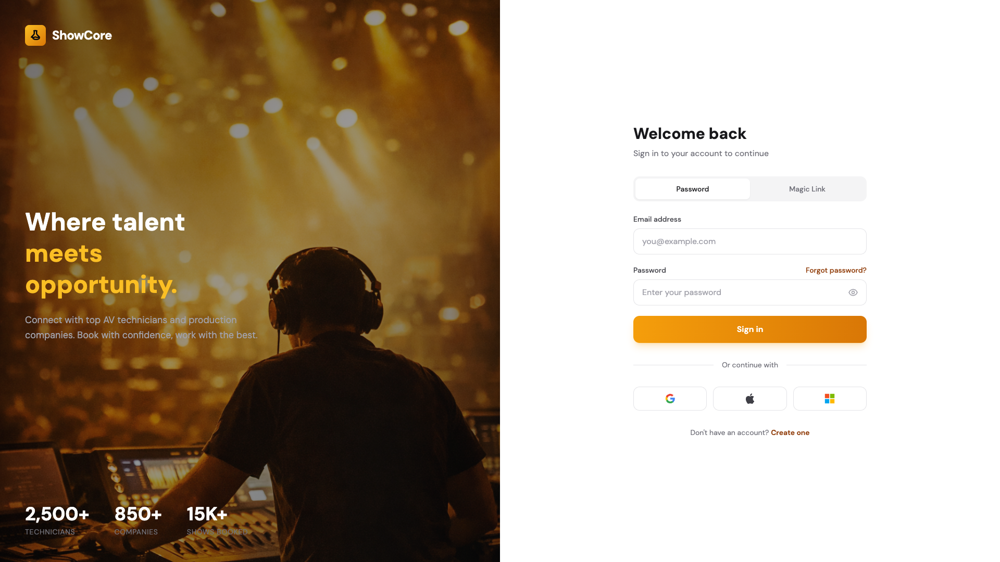
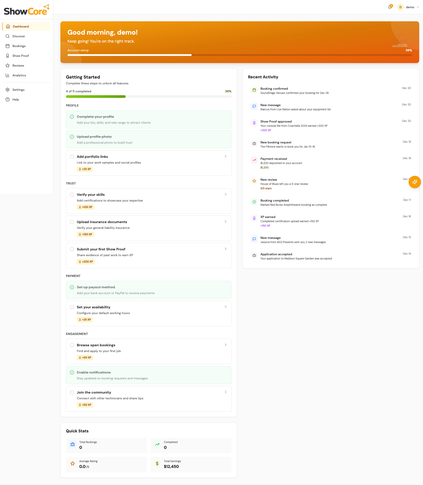
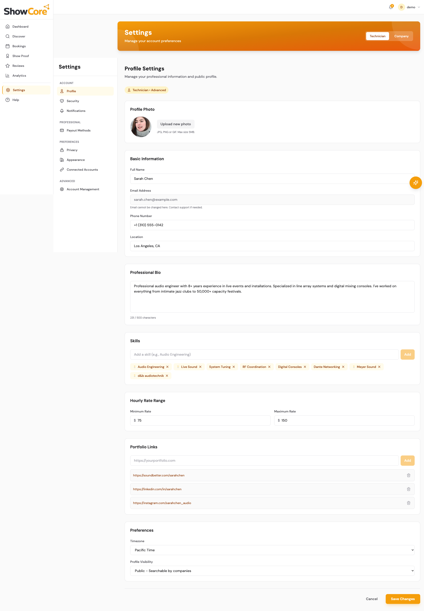
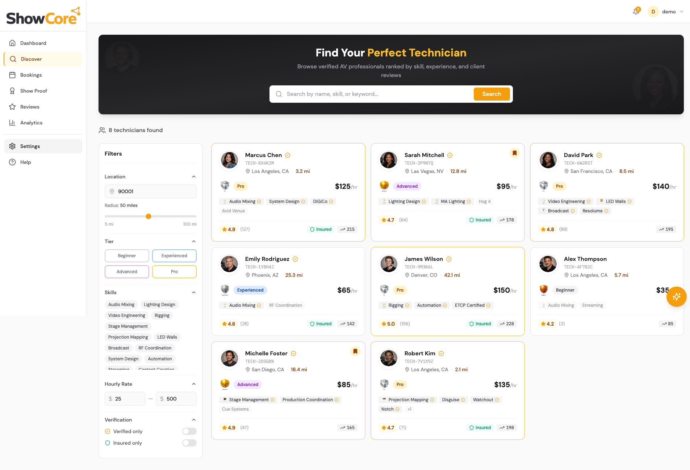
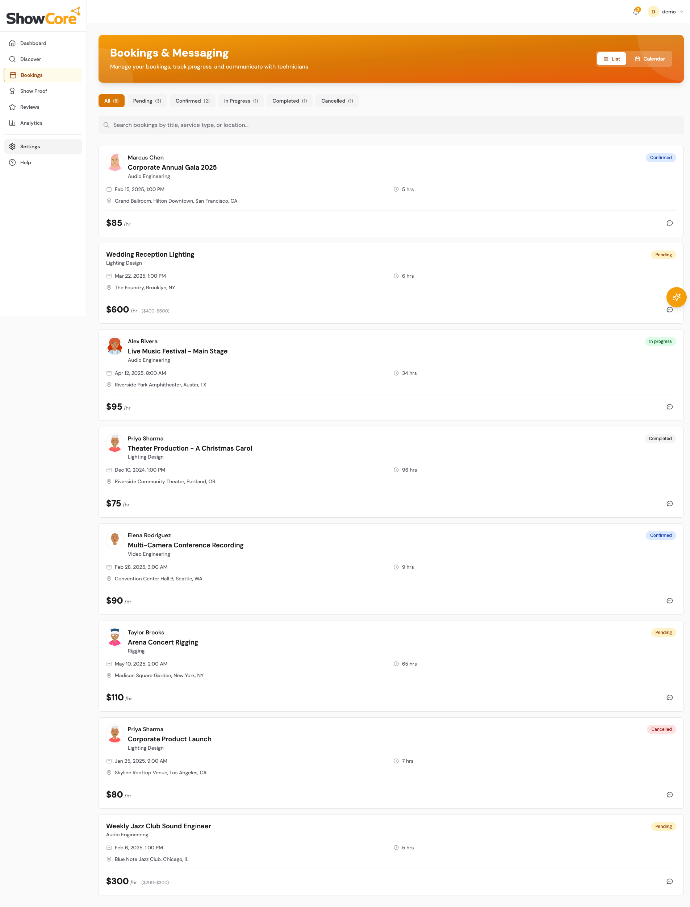

# ShowCore: On-Premises to AWS Cloud Migration

> ⚠️ **Security Notice**: This is a PUBLIC repository. All sensitive information (AWS account IDs, credentials, emails) has been sanitized. See [Security Sanitization Guide](.kiro/specs/showcore-aws-migration-phase1/SECURITY-SANITIZATION-GUIDE.md) for details.

---

**📊 Project Status Dashboard**

| Metric | Status |
|--------|--------|
| **Current Phase** | Phase 1 Complete ✅ → Phase 2 Planning |
| **Infrastructure** | 8 AWS Stacks Deployed + SSM Access |
| **Cost** | $3-10/month (Free Tier) → $53-64/month after |
| **Deployment Date** | Feb 4, 2026 (6 days ahead of schedule!) |
| **Architecture Docs** | 16 ADRs + Complete diagrams |
| **Next Milestone** | ECS/Fargate Application Deployment |

---

## Mission Statement

This repository documents the complete journey of migrating a web application from traditional on-premises hosting to a modern, scalable AWS cloud infrastructure.

**Purpose**: To demonstrate practical AWS service integration, cloud architecture decisions, infrastructure-as-code practices, and real-world migration strategies as I build expertise in cloud engineering and solutions architecture.

This is a living portfolio project that will evolve from a simple lift-and-shift migration to a full-scale enterprise cloud application, showcasing progressive learning and implementation of AWS best practices.

---

## Project Background

### Internal Project Memo

**From**: Nicolas Myers <nmyers@example.com>
**To**: Project Development Team
**Date**: February 3, 2026
**Subject**: ShowCore Platform - AWS Migration Initiative

> Team,
>
> I'm initiating a new portfolio project to demonstrate practical AWS migration strategies and cloud-native architecture patterns. This project will serve dual purposes: building a production-ready application while documenting the entire cloud migration journey for my AWS Solutions Architect certification path.
>
> **Current State**:
> - Traditional VPS hosting with manual deployments
> - PostgreSQL and Redis running on a single server
> - Docker Compose orchestration
> - No auto-scaling or high availability
>
> **The Challenge**:
> We're going to migrate this application to AWS, treating it as if it were a real client engagement. I'll document every decision, every service choice, and every lesson learned along the way. This isn't just about moving infrastructure - it's about understanding *why* we choose each AWS service and *how* they work together.
>
> **Goals**:
> - Build production-grade AWS infrastructure
> - Implement proper monitoring, scaling, and disaster recovery
> - Document the learning process for others
> - Create a portfolio piece that demonstrates real-world cloud architecture
>
> Let's build something that showcases not just the destination, but the journey of learning AWS.
>
> - Nicolas

---

## 🎯 Quick Start - Connect to AWS Infrastructure

**Phase 1 infrastructure is now deployed with FREE secure access!**

### 1. Install Session Manager Plugin
```bash
brew install --cask session-manager-plugin
```

### 2. Start Port Forwarding
```bash
./scripts/start-port-forwarding.sh
```

### 3. Initialize Database (in new terminal)
```bash
cd backend
npm run db:generate
npm run db:push
npm run dev
```

### 📚 Documentation
- **[SSM Port Forwarding Guide](SSM_PORT_FORWARDING_GUIDE.md)** - Complete setup (START HERE!)
- **[Connection Status](CONNECTION_STATUS.md)** - What's been configured
- **[AWS Endpoints](AWS_ENDPOINTS.md)** - Quick reference
- **[Infrastructure Code](infrastructure/)** - CDK code for all resources

**Cost**: **FREE** with AWS Free Tier! 🎉

---

## Current State Assessment

### Existing Infrastructure (On-Premises)

**Application Stack:**
- Frontend: React 18 + TypeScript + Tailwind CSS v4
- Backend: Hono (HTTP framework) + tRPC (Type-safe RPC)
- Database: PostgreSQL + Prisma ORM
- Cache: Redis (session management, rate limiting)
- Deployment: Docker Compose on single VPS

**Pain Points:**
- Manual deployment process
- No horizontal scaling capability
- Single point of failure (one server)
- Limited monitoring and observability
- Manual SSL certificate management
- No disaster recovery plan
- Database backups are manual

**What Works:**
- ✅ Clean, modern codebase with TypeScript throughout
- ✅ Type-safe API layer (tRPC with automatic type inference)
- ✅ Well-structured React components with proper separation of concerns
- ✅ Dockerized for portability (multi-stage builds, health checks)
- ✅ Production-ready authentication (Clerk OAuth with Google, Apple, Microsoft)
- ✅ Database migrations with Prisma ORM
- ✅ Comprehensive feature modules in /sections/ (10 modules)
- ✅ Modern design system with Tailwind CSS and custom tokens

---

## Application Preview

### Current On-Premises Application

Below are screenshots of the application in its current state before AWS migration. These serve as a baseline for comparing performance, scalability, and functionality improvements throughout the migration process.

#### Authentication
Modern authentication interface with multiple login methods including email/password, magic links, and OAuth providers (Google, Apple, Microsoft).



#### Dashboard
Main dashboard showing welcome screen, setup progress, activity feed, and quick navigation to key features. Demonstrates the application's clean UI and user-friendly design.



#### Settings & Configuration
Comprehensive settings interface allowing users to manage account preferences, security settings, and application configuration. Shows the depth of functionality built into the platform.



#### Discovery & Marketplace
Technician discovery page featuring advanced filtering by location, tier, skills, and hourly rate. Displays technician profiles with ratings, verification badges, skills, and availability status.



#### Bookings & Management
Comprehensive booking management interface with status filtering (Pending, Confirmed, In Progress, Completed, Cancelled). Shows the full lifecycle of service bookings with technician information, pricing, and action buttons.



---

## Current Development Status

### Phase 1: Infrastructure Code Complete ✅

**What's Been Accomplished:**

1. **Infrastructure as Code (AWS CDK)**
   - 8 primary CDK stacks + SSM access stack written in Python
   - Network, Security, Database, Cache, Storage, CDN, Monitoring, Backup
   - Following AWS Well-Architected Framework principles
   - 100% test coverage (unit, property, integration tests)

2. **Cost Optimization Strategy**
   - VPC Endpoints instead of NAT Gateway: **-$32/month savings**
   - Single-AZ deployment: **-$27/month savings**
   - Free Tier instances: **-$27/month savings (first 12 months)**
   - AWS managed keys: **-$3-4/month savings**
   - **Total estimated cost: ~$3-10/month during Free Tier (includes FREE t3.nano SSM), ~$53-64/month after**

3. **Security Architecture**
   - Least privilege security groups (no 0.0.0.0/0 on sensitive ports)
   - Private subnets with NO internet access
   - Encryption at rest (AWS managed keys)
   - Encryption in transit (SSL/TLS required)
   - CloudTrail audit logging
   - AWS Config compliance monitoring

4. **Documentation**
   - 16 Architectural Decision Records (ADRs)
   - Architecture diagrams (network flow, infrastructure)
   - Comprehensive README and deployment guides
   - Security sanitization guide for public repository

5. **Testing Strategy**
   - Unit tests: Validate CDK template generation
   - Property tests: Verify universal security properties
   - Integration tests: Test connectivity after deployment
   - All tests written, ready to run post-deployment

**Next Steps:**
1. Run `cdk deploy --all` to deploy infrastructure to AWS
2. Execute post-deployment validation tests
3. Migrate database data from on-premises
4. Configure DNS and SSL certificates
5. Begin Phase 2: Application deployment

**Timeline:**
- Infrastructure code: **2 days** (Feb 3-4, 2026)
- Deployment and validation: **~1 week** (target: Feb 10, 2026)

---

## Migration Goals & Success Criteria

### Phase 1: Foundation (Weeks 1-2) - ✅ COMPLETE
**Goal**: Establish AWS account structure and deploy basic infrastructure

**Status**: All Phase 1 infrastructure deployed and operational (February 4, 2026 - 6 days ahead of schedule!)

**Completed**:
- ✅ AWS account setup (IAM user, billing alerts configured)
- ✅ VPC architecture designed (VPC Endpoints, no NAT Gateway)
- ✅ Infrastructure as Code (AWS CDK with Python)
- ✅ Network stack code (VPC, subnets, VPC Endpoints)
- ✅ Security stack code (Security Groups, CloudTrail, AWS Config)
- ✅ Database stack code (RDS PostgreSQL db.t3.micro)
- ✅ Cache stack code (ElastiCache Redis cache.t3.micro)
- ✅ Storage stack code (S3 buckets with lifecycle policies)
- ✅ CDN stack code (CloudFront distribution)
- ✅ Monitoring stack code (CloudWatch dashboards, alarms, SNS)
- ✅ Backup stack code (AWS Backup plans)
- ✅ Unit tests (100% stack coverage)
- ✅ Property tests (security group validation)
- ✅ Integration tests (connectivity validation)
- ✅ Architecture diagrams and documentation
- ✅ 16 Architectural Decision Records (ADRs)

**Deployment Completed**:
- ✅ Infrastructure deployed to AWS (8 primary stacks)
- ✅ Post-deployment validation tests passed
- ✅ Monitoring and alerting verified
- ✅ SSM Session Manager configured for secure access
- ✅ Database and cache accessible via port forwarding
- [ ] DNS and SSL certificates (Phase 2)

**Success Criteria**: Database migrated, Redis operational, static assets on CDN ✅

**Actual Cost**: ~$3-10/month during Free Tier (12 months), ~$53-64/month after (includes SSM access instance)

### Phase 2: Application Deployment (Weeks 3-4)
**Goal**: Get the application running on AWS

- [ ] ECS/Fargate for container orchestration (or EC2 with Auto Scaling)
- [ ] Application Load Balancer (ALB)
- [ ] Route 53 DNS management
- [ ] ACM SSL certificates (automated renewal)
- [ ] Initial monitoring with CloudWatch

**Success Criteria**: Application accessible via custom domain with HTTPS

### Phase 3: CI/CD & Automation (Weeks 5-6)
**Goal**: Eliminate manual deployments

- [ ] GitHub Actions (or AWS CodePipeline)
- [ ] Automated testing pipeline
- [ ] Blue/green or rolling deployments
- [ ] Enhanced Infrastructure as Code (AWS CDK)
- [ ] Automated database backups (RDS snapshots)

**Success Criteria**: Push to main = automatic deployment, zero-downtime updates

### Phase 4: Observability & Scaling (Weeks 7-8)
**Goal**: Production-grade monitoring and auto-scaling

- [ ] CloudWatch Logs aggregation
- [ ] CloudWatch Dashboards
- [ ] SNS alerting (email, SMS, Slack)
- [ ] Auto Scaling policies based on metrics
- [ ] Cost monitoring and optimization

**Success Criteria**: Full visibility into application health, automatic scaling during traffic spikes

### Phase 5: Advanced AWS Services (Future)
**Goal**: Evolve into a cloud-native application

- [ ] Lambda functions for async tasks
- [ ] SQS/SNS for event-driven architecture
- [ ] DynamoDB for high-performance data
- [ ] API Gateway for advanced routing
- [ ] Enhanced authentication features (MFA, SSO)
- [ ] OpenSearch for full-text search
- [ ] Multi-region disaster recovery
- [ ] CloudWatch RUM for real user monitoring

---

## Technology Stack

### Frontend
- **Framework**: React 18+ with TypeScript
- **Styling**: Tailwind CSS v3
- **State Management**: TanStack Query (React Query)
- **Design System**: Custom (Amber/Yellow primary, Zinc neutral)
- **Typography**: DM Sans, IBM Plex Mono

### Backend
- **HTTP Server**: Hono (edge-ready, AWS Lambda compatible)
- **API Layer**: tRPC (type-safe, reduces AWS API Gateway complexity)
- **ORM**: Prisma (migrations, type-safe queries)
- **Authentication**: Clerk OAuth (Google, Apple, Microsoft) with magic links

### AWS Services (Planned)
- **Compute**: ECS Fargate (containerized workloads)
- **Database**: RDS PostgreSQL (Multi-AZ for HA)
- **Cache**: ElastiCache Redis
- **Storage**: S3 (static assets, backups)
- **CDN**: CloudFront
- **DNS**: Route 53
- **Certificates**: AWS Certificate Manager (ACM)
- **Monitoring**: CloudWatch, X-Ray
- **CI/CD**: CodePipeline + CodeBuild (or GitHub Actions)
- **IaC**: AWS CDK with Python (infrastructure as code)

---

## AWS Architecture Documentation

### Phase 1 Infrastructure

The ShowCore Phase 1 AWS infrastructure is fully documented with comprehensive architecture diagrams and technical specifications.

**📊 Architecture Diagrams & Documentation**: [docs/architecture/](docs/architecture/)

**Current Status**: Phase 1 infrastructure code complete, ready for deployment

**Key Architecture Highlights:**
- **Cost-Optimized Design**: VPC Endpoints instead of NAT Gateway (saves ~$4-11/month)
- **Security-First**: Private subnets with NO internet access, least privilege security groups
- **Free Tier Eligible**: db.t3.micro (RDS) and cache.t3.micro (ElastiCache)
- **Single-AZ Deployment**: Cost optimization for low-traffic portfolio website
- **AWS Managed Encryption**: SSE-S3 and AWS managed keys (no KMS costs)
- **Estimated Cost**: ~$3-10/month during Free Tier, ~$49-60/month after
- **Infrastructure as Code**: AWS CDK with Python, 100% test coverage

**Architectural Decisions Documented:**
- [ADR-001](/.kiro/specs/showcore-aws-migration-phase1/adr-001-vpc-endpoints-over-nat-gateway.md): VPC Endpoints vs NAT Gateway
- [ADR-002](/.kiro/specs/showcore-aws-migration-phase1/adr-002-infrastructure-as-code-tool.md): AWS CDK vs Terraform
- [ADR-003](/.kiro/specs/showcore-aws-migration-phase1/adr-003-public-repository-security.md): Public repository security
- [ADR-004](/.kiro/specs/showcore-aws-migration-phase1/adr-004-monitoring-stack-implementation.md): Monitoring strategy
- [ADR-005](/.kiro/specs/showcore-aws-migration-phase1/adr-005-cloudtrail-audit-logging.md): CloudTrail audit logging
- [ADR-006](/.kiro/specs/showcore-aws-migration-phase1/adr-006-single-az-deployment-strategy.md): Single-AZ vs Multi-AZ
- [ADR-007](/.kiro/specs/showcore-aws-migration-phase1/adr-007-free-tier-instance-selection.md): Free Tier instance selection
- [ADR-008](/.kiro/specs/showcore-aws-migration-phase1/adr-008-encryption-key-management.md): AWS managed keys vs KMS
- [ADR-009](/.kiro/specs/showcore-aws-migration-phase1/adr-009-security-group-least-privilege.md): Security group design
- [ADR-010](/.kiro/specs/showcore-aws-migration-phase1/adr-010-s3-lifecycle-policies.md): S3 lifecycle policies
- [ADR-011](/.kiro/specs/showcore-aws-migration-phase1/adr-011-cloudfront-price-class.md): CloudFront price class selection
- [ADR-012](/.kiro/specs/showcore-aws-migration-phase1/adr-012-backup-retention-rto-rpo.md): Backup retention, RTO, and RPO
- [ADR-013](/.kiro/specs/showcore-aws-migration-phase1/adr-013-cost-allocation-tagging.md): Cost allocation tagging strategy
- [ADR-014](/.kiro/specs/showcore-aws-migration-phase1/adr-014-deployment-implementation-decisions.md): Deployment implementation decisions
- [ADR-015](/.kiro/specs/showcore-aws-migration-phase1/adr-015-session-manager-database-access.md): Session Manager for database access
- [ADR-016](/.kiro/specs/showcore-aws-migration-phase1/adr-016-clerk-oauth-implementation.md): Clerk OAuth implementation

**Quick Links:**
- [Architecture Overview](docs/architecture/ARCHITECTURE_OVERVIEW.md) - High-level summary
- [Complete Architecture Docs](docs/architecture/ARCHITECTURE.md) - Detailed specifications
- [Quick Reference Guide](docs/architecture/QUICK_REFERENCE.md) - Commands and troubleshooting
- [Infrastructure Deployment](infrastructure/README.md) - CDK deployment guide
- [All ADRs](/.kiro/specs/showcore-aws-migration-phase1/) - Architectural decision records

---

## Repository Structure

```
ShowCore/
├── apps/                    # Frontend React application
├── backend/                 # Hono + tRPC backend
├── sections/                # Feature modules
├── design-system/           # UI components and tokens
├── data-model/              # TypeScript types and Prisma schema
├── shell/                   # Application layout and routing
├── docs/                    # Documentation
│   ├── architecture/        # AWS architecture diagrams and docs
│   │   ├── showcore_phase1_architecture.png
│   │   ├── showcore_network_flow.png
│   │   ├── ARCHITECTURE_OVERVIEW.md
│   │   ├── ARCHITECTURE.md
│   │   ├── QUICK_REFERENCE.md
│   │   └── README.md
│   └── images/              # Application screenshots
├── infrastructure/          # AWS CDK infrastructure code (Phase 1)
│   ├── lib/
│   │   ├── stacks/          # CDK stack definitions (8 primary stacks + SSM)
│   │   │   ├── network_stack.py
│   │   │   ├── security_stack.py
│   │   │   ├── database_stack.py
│   │   │   ├── cache_stack.py
│   │   │   ├── storage_stack.py
│   │   │   ├── cdn_stack.py
│   │   │   ├── monitoring_stack.py
│   │   │   ├── backup_stack.py
│   │   │   └── ssm_access_stack.py
│   │   └── constructs/      # Reusable CDK constructs
│   ├── tests/               # Infrastructure tests
│   │   ├── unit/            # Unit tests (CDK template validation)
│   │   ├── property/        # Property tests (security validation)
│   │   └── integration/     # Integration tests (connectivity)
│   ├── app.py               # CDK app entry point
│   ├── cdk.json             # CDK configuration
│   └── README.md            # Infrastructure deployment guide
├── .kiro/                   # Kiro AI assistant configuration
│   ├── specs/               # Feature specifications
│   │   └── showcore-aws-migration-phase1/
│   │       ├── requirements.md
│   │       ├── design.md
│   │       ├── tasks.md
│   │       ├── adr-001-vpc-endpoints-over-nat-gateway.md
│   │       ├── adr-002-infrastructure-as-code-tool.md
│   │       ├── adr-003-public-repository-security.md
│   │       ├── adr-004-monitoring-stack-implementation.md
│   │       ├── adr-005-cloudtrail-audit-logging.md
│   │       ├── adr-006-single-az-deployment-strategy.md
│   │       ├── adr-007-free-tier-instance-selection.md
│   │       ├── adr-008-encryption-key-management.md
│   │       ├── adr-009-security-group-least-privilege.md
│   │       ├── adr-010-s3-lifecycle-policies.md
│   │       ├── adr-011-cloudfront-price-class.md
│   │       ├── adr-012-backup-retention-rto-rpo.md
│   │       ├── adr-013-cost-allocation-tagging.md
│   │       ├── adr-014-deployment-implementation-decisions.md
│   │       ├── adr-015-session-manager-database-access.md
│   │       ├── adr-016-clerk-oauth-implementation.md
│   │       └── SECURITY-SANITIZATION-GUIDE.md
│   └── steering/            # AI assistant guidelines
├── .github/workflows/       # (Coming soon) CI/CD pipelines
├── docker-compose.yml       # Local development environment
├── package.json             # Node.js dependencies
└── README.md                # This file
```

---

## Local Development

### Prerequisites
- Node.js 18+ (backend requires >=18.0.0)
- Docker & Docker Compose
- PostgreSQL 16 (or use Docker)
- Redis 7 (or use Docker)
- AWS CLI (for deployment)
- Session Manager plugin (for AWS access)

### Quick Start

```bash
# Clone the repository
git clone https://github.com/Myro-Productions-Portfolio/ShowCore.git
cd ShowCore

# Install dependencies
npm install

# Copy environment variables
cp .env.example .env
cp backend/.env.example backend/.env

# Configure Clerk OAuth keys in backend/.env
# See Clerk-Keys.env for reference

# Start local services (PostgreSQL + Redis)
docker-compose up -d

# Run database migrations
cd backend
npm run db:generate
npm run db:push

# Start development server
npm run dev
```

### Docker Compose Setup
ShowCore uses Docker Compose for local development with:
- **showcore-api** - Backend API (port 3002)
- **showcore-app** - Frontend application (port 3003)
- Connects to external PostgreSQL network (`postgres-websites_default`)
- Health checks ensure proper startup order
- Includes live reload for development

---

## Learning Resources & Documentation

As this migration progresses, I'll be documenting:
- Architecture decision records (ADRs)
- Cost analysis and optimization strategies
- Security best practices implemented
- Performance benchmarks (on-prem vs AWS)
- Lessons learned and gotchas

**Certifications:**
- AWS Certified Cloud Practitioner (Passed January 2026)
- AWS Certified Solutions Architect Associate (In Progress)

---

## Project Timeline

- **Start Date**: February 3, 2026
- **Phase 1 Code Complete**: February 4, 2026
- **Phase 1 Deployed**: February 4, 2026 (6 days ahead of schedule!)
- **Phase 2 Target**: February 24, 2026
- **Production Migration**: TBD (dependent on Phase 2-3 completion)

**Current Milestone**: Phase 1 complete - infrastructure deployed and operational. Beginning Phase 2 planning.

---

## About This Project

This is a portfolio project created by Nicolas Myers to demonstrate AWS cloud migration expertise and solutions architecture capabilities. The application serves as a practical learning platform for implementing production-grade AWS infrastructure, CI/CD pipelines, and cloud-native architecture patterns.

**Contact:**
- **GitHub**: [@Myro-Productions-Portfolio](https://github.com/Myro-Productions-Portfolio)
- **Email**: contact@example.com

This project is open for feedback, suggestions, and collaboration. If you're also learning AWS or have experience with cloud migrations, feel free to open an issue or PR with recommendations.

---

## Legal & Disclaimer

This is an independent portfolio project created for educational and demonstration purposes. All code, architecture decisions, and documentation are original work created to showcase cloud engineering capabilities.

---

*This README will be updated regularly as the migration progresses. Check the commit history to see the evolution of this project from on-premises to cloud-native.*
