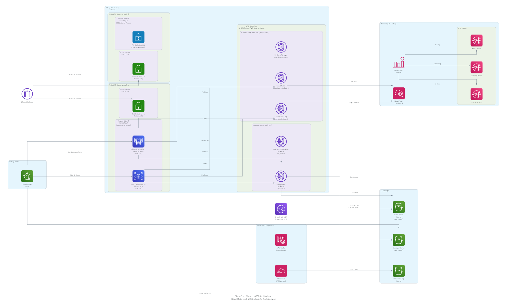

# ShowCore Phase 1 AWS Architecture

## Overview

This document describes the AWS architecture for ShowCore Phase 1, which establishes the foundational infrastructure for migrating ShowCore from on-premises to AWS.

## Architecture Diagram



## Key Design Principles

### 1. Cost Optimization
- **NO NAT Gateway**: Saves ~$32/month by using VPC Endpoints instead
- **Free Tier Eligible**: db.t3.micro (RDS) and cache.t3.micro (ElastiCache)
- **Single-AZ Deployment**: Cost-optimized for low-traffic project website
- **Gateway Endpoints**: FREE for S3 and DynamoDB access
- **Minimal Interface Endpoints**: Only essential services (~$7/month each)

### 2. Security
- **Private Subnets**: NO internet access (no NAT Gateway route)
- **VPC Endpoints**: Secure AWS service access without internet
- **Encryption at Rest**: SSE-S3 for S3, AWS managed keys for RDS/ElastiCache
- **Encryption in Transit**: TLS 1.2+ for all connections
- **Least Privilege**: Security groups follow least privilege principle

### 3. High Availability
- **Multi-AZ VPC**: Spans us-east-1a and us-east-1b
- **Single-AZ Resources**: RDS and ElastiCache in us-east-1a (cost optimization)
- **Automated Backups**: Daily backups with 7-day retention
- **Point-in-Time Recovery**: RDS supports 5-minute granularity

## Network Architecture

### VPC Configuration
- **CIDR Block**: 10.0.0.0/16 (65,536 IPs)
- **Region**: us-east-1
- **Availability Zones**: us-east-1a, us-east-1b

### Subnets

#### Public Subnets (Internet Access via Internet Gateway)
- **us-east-1a**: 10.0.0.0/24 (256 IPs) - Future Application Load Balancer
- **us-east-1b**: 10.0.1.0/24 (256 IPs) - Future Application Load Balancer

#### Private Subnets (NO Internet Access)
- **us-east-1a**: 10.0.2.0/24 (256 IPs) - RDS, ElastiCache, Future App Tier
- **us-east-1b**: 10.0.3.0/24 (256 IPs) - Future Expansion

### Route Tables

#### Public Subnet Route Tables
```
Destination       Target
10.0.0.0/16       local (VPC CIDR)
0.0.0.0/0         igw-xxxxx (Internet Gateway)
```

#### Private Subnet Route Tables
```
Destination       Target
10.0.0.0/16       local (VPC CIDR)
pl-63a5400a       vpce-xxxxx (S3 Gateway Endpoint)
pl-02cd2c6b       vpce-xxxxx (DynamoDB Gateway Endpoint)
NO DEFAULT ROUTE  NO NAT Gateway or Internet Gateway
```

## VPC Endpoints Architecture

### Why VPC Endpoints Instead of NAT Gateway?

**Cost Savings:**
- NAT Gateway: ~$32/month + data processing charges
- VPC Endpoints: Gateway Endpoints FREE, Interface Endpoints ~$7/month each
- **Net savings: ~$4-11/month**

**Security Benefits:**
- Private subnets have NO internet access
- AWS service traffic stays within AWS network
- No exposure to internet threats

### Gateway Endpoints (FREE)

#### S3 Gateway Endpoint
- **Purpose**: Access S3 for backups, logs, and static assets
- **Cost**: FREE
- **Use Cases**:
  - RDS backups to S3
  - Application logs to S3
  - Static asset storage
  - CloudTrail logs to S3

#### DynamoDB Gateway Endpoint
- **Purpose**: Future application data storage
- **Cost**: FREE
- **Use Cases**: Reserved for future application needs

### Interface Endpoints (~$7/month each)

#### CloudWatch Logs Interface Endpoint
- **Purpose**: Send logs from RDS, ElastiCache, and applications
- **Cost**: ~$7/month + data processing
- **Use Cases**:
  - RDS logs to CloudWatch
  - ElastiCache logs to CloudWatch
  - Future application logs

#### CloudWatch Monitoring Interface Endpoint
- **Purpose**: Send metrics and alarms to CloudWatch
- **Cost**: ~$7/month + data processing
- **Use Cases**:
  - RDS metrics
  - ElastiCache metrics
  - Custom application metrics
  - CloudWatch alarms

#### Systems Manager Interface Endpoint
- **Purpose**: Session Manager for secure instance access
- **Cost**: ~$7/month + data processing
- **Security Benefits**:
  - No SSH keys to manage
  - No open SSH ports (22)
  - All sessions logged to CloudWatch
  - IAM-based access control

## Data Layer

### RDS PostgreSQL
- **Engine**: PostgreSQL 16.x
- **Instance Class**: db.t3.micro (2 vCPU, 1 GB RAM)
- **Storage**: 20 GB gp3 SSD
- **Multi-AZ**: Disabled (cost optimization)
- **Backup**: Automated daily backups, 7-day retention
- **Encryption**: AWS managed keys
- **Monitoring**: Performance Insights, Enhanced Monitoring

### ElastiCache Redis
- **Engine**: Redis 7.x
- **Node Type**: cache.t3.micro (2 vCPU, 0.5 GB RAM)
- **Cluster Mode**: Disabled (single node)
- **Nodes**: 1 node (no replicas)
- **Backup**: Daily snapshots, 7-day retention
- **Encryption**: AWS managed encryption
- **Monitoring**: CloudWatch metrics

## Storage & CDN

### S3 Buckets

#### Static Assets Bucket
- **Name**: showcore-static-assets-{account-id}
- **Versioning**: Enabled
- **Encryption**: SSE-S3 (free)
- **Lifecycle**: Delete old versions after 90 days
- **Access**: Private (CloudFront only via OAC)

#### Backups Bucket
- **Name**: showcore-backups-{account-id}
- **Versioning**: Enabled
- **Encryption**: SSE-S3 (free)
- **Lifecycle**: 
  - Transition to Glacier after 30 days
  - Delete after 90 days
- **Access**: Private (IAM only)

#### CloudTrail Logs Bucket
- **Name**: showcore-cloudtrail-logs-{account-id}
- **Versioning**: Enabled
- **Encryption**: SSE-S3 (free)
- **Lifecycle**:
  - Transition to Glacier after 90 days
  - Delete after 1 year
- **Access**: CloudTrail only

### CloudFront Distribution
- **Origin**: S3 static assets bucket
- **Price Class**: PriceClass_100 (North America and Europe only)
- **SSL/TLS**: TLS 1.2 minimum
- **Caching**: Default TTL 24 hours, Max TTL 1 year
- **Compression**: Automatic compression enabled
- **Access**: Origin Access Control (OAC) for secure S3 access

## Security & Compliance

### CloudTrail
- **Scope**: All regions
- **Log File Validation**: Enabled
- **Encryption**: SSE-S3
- **Storage**: Dedicated S3 bucket
- **Purpose**: Audit all API calls

### AWS Config
- **Purpose**: Continuous compliance monitoring
- **Rules**:
  - rds-storage-encrypted
  - s3-bucket-public-read-prohibited
  - elasticache-redis-cluster-automatic-backup-check
- **Remediation**: Manual review and fix

### Security Groups

#### VPC Endpoint Security Group
```
Ingress:
- Protocol: TCP
- Port: 443
- Source: 10.0.0.0/16 (VPC CIDR)
- Description: HTTPS from VPC for AWS service access

Egress: None (stateful firewall)
```

#### RDS Security Group
```
Ingress:
- Protocol: TCP
- Port: 5432
- Source: app_sg (Future application security group)
- Description: PostgreSQL from application tier

Egress: None (stateful firewall)
```

#### ElastiCache Security Group
```
Ingress:
- Protocol: TCP
- Port: 6379
- Source: app_sg (Future application security group)
- Description: Redis from application tier

Egress: None (stateful firewall)
```

## Monitoring & Alerting

### CloudWatch Dashboard
- **RDS Metrics**: CPU, connections, read/write latency, storage
- **ElastiCache Metrics**: CPU, memory, evictions, cache hit rate
- **S3 Metrics**: Bucket size, request count, errors
- **CloudFront Metrics**: Requests, data transfer, cache hit rate
- **VPC Metrics**: VPC Endpoint data processed

### CloudWatch Alarms

#### Critical Alarms (SNS: Critical Alerts)
- RDS CPU > 80% for 10 minutes
- RDS storage < 15% free
- ElastiCache memory > 80% for 10 minutes
- ElastiCache CPU > 75% for 10 minutes

#### Warning Alarms (SNS: Warning Alerts)
- RDS connections > 80
- ElastiCache cache hit rate < 80%

#### Billing Alarms (SNS: Billing Alerts)
- Estimated charges > $50
- Estimated charges > $100

### SNS Topics
- **Critical Alerts**: admin@showcore.com, oncall@showcore.com
- **Warning Alerts**: devops@showcore.com
- **Billing Alerts**: finance@showcore.com, admin@showcore.com

## Backup & Disaster Recovery

### AWS Backup
- **Backup Vault**: Encrypted with AWS managed keys
- **Backup Plans**:
  - RDS: Daily backups, 7-day retention
  - ElastiCache: Daily snapshots, 7-day retention
- **Cross-Region Backup**: Disabled (cost optimization)

### Recovery Objectives
- **RDS**: RTO < 30 minutes, RPO < 5 minutes (point-in-time recovery)
- **ElastiCache**: RTO < 15 minutes, RPO < 24 hours (daily snapshots)
- **S3**: RTO < 5 minutes (versioning), RPO = 0 (immediate replication)

## Cost Breakdown

### During Free Tier (First 12 Months)
- **RDS db.t3.micro**: $0 (750 hours/month free)
- **ElastiCache cache.t3.micro**: $0 (750 hours/month free)
- **VPC Endpoints**:
  - Gateway Endpoints (S3, DynamoDB): $0 (FREE)
  - Interface Endpoints (3 endpoints): ~$21/month ($7/month each)
- **S3 Storage**: ~$1-5/month (first 5 GB free)
- **CloudFront**: ~$1-5/month (first 1 TB free)
- **Data Transfer**: ~$0-5/month (first 100 GB free)
- **CloudWatch**: ~$0-5/month (basic metrics free)
- **Total**: ~$3-10/month

### After Free Tier (Month 13+)
- **RDS db.t3.micro**: ~$15/month
- **ElastiCache cache.t3.micro**: ~$12/month
- **VPC Endpoints**: ~$21/month
- **Other costs**: ~$1-12/month
- **Total**: ~$49-60/month

### Cost Comparison vs NAT Gateway Architecture
| Item | NAT Gateway | VPC Endpoints | Savings |
|------|-------------|---------------|---------|
| NAT Gateway | ~$32/month | $0 | +$32 |
| Gateway Endpoints | $0 | $0 | $0 |
| Interface Endpoints | $0 | ~$21/month | -$21 |
| **Net Monthly Cost** | **~$32/month** | **~$21/month** | **~$11/month** |

## Infrastructure as Code

### CDK Stack Structure
```
ShowCorePhase1App
├── ShowCoreSecurityStack (CloudTrail, AWS Config)
├── ShowCoreMonitoringStack (CloudWatch, SNS, Alarms)
├── ShowCoreNetworkStack (VPC, Subnets, VPC Endpoints)
├── ShowCoreDatabaseStack (RDS PostgreSQL)
├── ShowCoreCacheStack (ElastiCache Redis)
├── ShowCoreStorageStack (S3 Buckets)
├── ShowCoreCDNStack (CloudFront Distribution)
└── ShowCoreBackupStack (AWS Backup Plans)
```

### Resource Tagging
All resources are tagged with:
- **Project**: ShowCore
- **Phase**: Phase1
- **Environment**: Production
- **ManagedBy**: CDK
- **CostCenter**: Engineering
- **Component**: Network, Database, Cache, Storage, CDN, etc.

## Deployment

### Prerequisites
1. AWS Account with appropriate permissions
2. AWS CLI v2 configured
3. Python 3.9+
4. Node.js 14+
5. AWS CDK CLI

### Deployment Order
1. SecurityStack (CloudTrail, AWS Config)
2. MonitoringStack (SNS topics, billing alarms)
3. NetworkStack (VPC, subnets, VPC endpoints)
4. DatabaseStack (RDS PostgreSQL)
5. CacheStack (ElastiCache Redis)
6. StorageStack (S3 buckets)
7. CDNStack (CloudFront distribution)
8. BackupStack (AWS Backup plans)

### Deployment Commands
```bash
# Bootstrap CDK (first time only)
cdk bootstrap aws://YOUR_ACCOUNT_ID/us-east-1

# Deploy all stacks
cdk deploy --all

# Deploy specific stack
cdk deploy ShowCoreNetworkStack
```

## Management Implications

### Manual Patching
- RDS and ElastiCache cannot download patches from the internet
- AWS manages patching automatically during maintenance windows
- No action required from operators

### Application Updates
- Future application instances cannot download packages from the internet
- Solutions:
  - Use S3 to host packages, access via S3 Gateway Endpoint
  - Use Systems Manager to manage instances
  - Pre-bake AMIs with required packages

### Third-Party APIs
- Applications cannot call external APIs from private subnets
- Solutions:
  - Use API Gateway or Lambda in public subnets as proxy
  - Add NAT Gateway if external API access becomes critical
  - Trade-off: Acceptable for Phase 1 (data layer only)

## Future Enhancements

### Phase 2 (Application Tier)
- Application Load Balancer in public subnets
- ECS Fargate or EC2 instances in private subnets
- Auto Scaling based on traffic
- WAF for application protection

### Phase 3 (Multi-AZ High Availability)
- Enable RDS Multi-AZ deployment
- Add ElastiCache replicas
- Cross-region backup replication
- Route 53 health checks and failover

### Phase 4 (Advanced Monitoring)
- Enable VPC Flow Logs
- Enable GuardDuty for threat detection
- AWS Security Hub for centralized security
- X-Ray for distributed tracing

## References

- [AWS VPC Endpoints Documentation](https://docs.aws.amazon.com/vpc/latest/privatelink/vpc-endpoints.html)
- [AWS Well-Architected Framework](https://aws.amazon.com/architecture/well-architected/)
- [AWS CDK Documentation](https://docs.aws.amazon.com/cdk/latest/guide/home.html)
- [AWS Free Tier](https://aws.amazon.com/free/)
- [ShowCore Infrastructure README](README.md)
