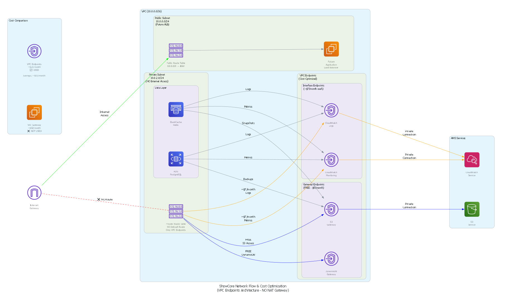

# ShowCore AWS Architecture Documentation

This directory contains all architecture diagrams and documentation for the ShowCore AWS infrastructure.

## Architecture Diagrams

### Complete Architecture


**File**: `showcore_phase1_architecture.png`

Shows the complete AWS infrastructure including:
- VPC with multi-AZ subnets
- RDS PostgreSQL and ElastiCache Redis
- VPC Endpoints (Gateway and Interface)
- S3 buckets and CloudFront CDN
- Security, monitoring, and backup components

### Network Flow & Cost Optimization


**File**: `showcore_network_flow.png`

Focuses on:
- VPC Endpoints architecture
- Cost comparison (NAT Gateway vs VPC Endpoints)
- Network traffic flows
- Security boundaries

## Documentation

- **[ARCHITECTURE_OVERVIEW.md](ARCHITECTURE_OVERVIEW.md)** - High-level architecture summary and key decisions
- **[ARCHITECTURE.md](ARCHITECTURE.md)** - Complete technical specifications and detailed documentation
- **[QUICK_REFERENCE.md](QUICK_REFERENCE.md)** - Quick reference guide with commands, costs, and troubleshooting
- **[DIAGRAMS.md](DIAGRAMS.md)** - How to regenerate and customize diagrams
- **[DIAGRAM_GENERATION_SUMMARY.md](DIAGRAM_GENERATION_SUMMARY.md)** - Summary of diagram generation process

## Regenerating Diagrams

### Prerequisites
```bash
# Install Graphviz
choco install graphviz  # Windows
brew install graphviz   # macOS

# Install Python diagrams library
pip install diagrams
```

### Generate Diagrams
```bash
# From project root
python docs/architecture/create_architecture_diagram.py
python docs/architecture/create_network_flow_diagram.py

# Move generated files to docs/architecture/
move showcore_phase1_architecture.png docs/architecture/
move showcore_network_flow.png docs/architecture/
```

## Key Architecture Highlights

### Cost Optimization
- **NO NAT Gateway**: Saves ~$32/month
- **VPC Endpoints**: Gateway Endpoints FREE, Interface Endpoints ~$7/month each
- **Free Tier Eligible**: db.t3.micro (RDS), cache.t3.micro (ElastiCache)
- **Net Savings**: ~$11/month vs NAT Gateway architecture

### Estimated Monthly Cost
- **During Free Tier**: ~$3-10/month
- **After Free Tier**: ~$49-60/month

### Security
- Private subnets with NO internet access
- VPC Endpoints for secure AWS service access
- Encryption at rest and in transit
- Least privilege security groups

## Related Documentation

- [Infrastructure Deployment Guide](../../infrastructure/README.md)
- [Project README](../../README.md)
